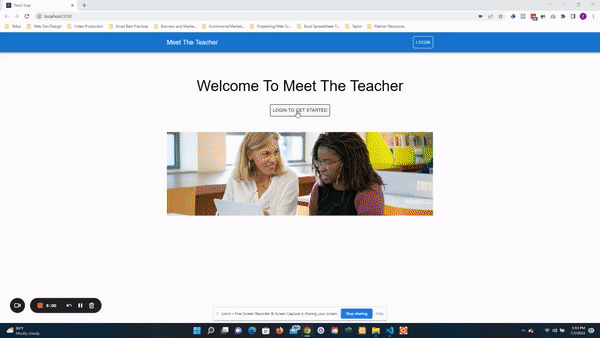
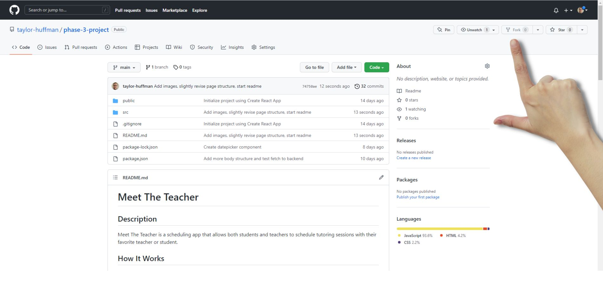
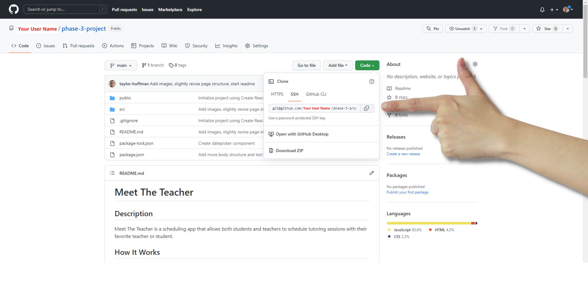
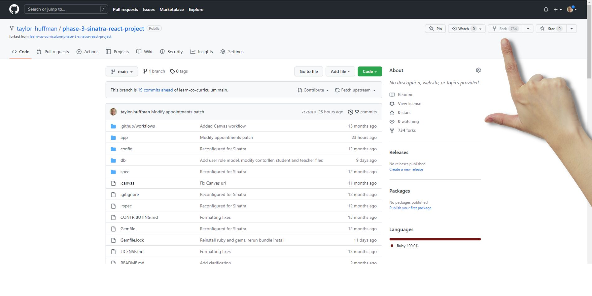
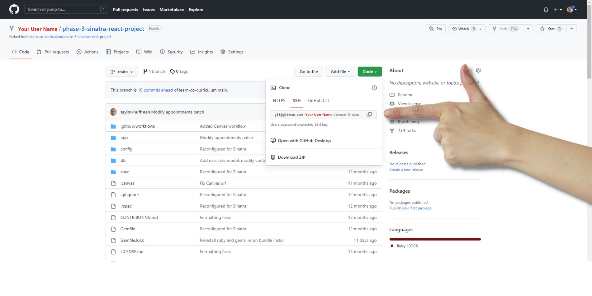

# Meet The Teacher

## Description
Meet The Teacher is a scheduling app that allows both students and teachers to schedule tutoring sessions with their favorite teacher or student.



## Project Setup
### Frontend Setup
Start by forking the frontend of the project



Next, grab your SSH key. (Make sure you see your user name where the red text is)



Next, navigate to your desired folder in Ubuntu and type in the following command to clone your newly created repo, making sure your username is taking place of 'your-user-name' in the url:

```
git clone git@github.com:your-user-name/phase-3-project.git
```

Then, navigate to the root folder of the project:

```
cd phase-3-project/
```

Once in the root folder, copy and paste the following command to open VS Code:

```
code .
```

Once VS Code is open, click " Ctrl + ` " to open the VS Code terminal, then type in the following command to install the frontend project dependencies:
```
npm install
```
Leave the frontend project files open in VSCode as we'll return to it in just a minute.
### Backend Setup
Next, fork the backend of the project. The backend can be found at the link below:
https://github.com/taylor-huffman/phase-3-sinatra-react-project


Next, grab your SSH key. (Make sure you see your user name where the red text is)

Next, navigate to your desired folder in Ubuntu and type in the following command to clone your newly created repo, making sure your username is taking place of 'your-user-name' in the url:
```
git clone git@github.com:your-user-name/phase-3-sinatra-react-project.git
```
Then, navigate to the root folder of the project:
```
cd phase-3-sinatra-react-project/
```
Once in the root folder, copy and paste the following command to open VS Code:
```
code .
```
Once VS Code is open, click " Ctrl + ` " to open the VS Code terminal, then type in the following command to install the project dependencies:
```
bundle install
```
Finally, run the following command to start up your backend server:
```
rake server
```
Leave backend files open in VSCode.
### Return to the frontend project files in VSCode
In your terminal, type in the following command:
```
npm start
```
And there you have it, the Meet The Teacher app should now be open in your browser and you should have both the frontend and backend files open in VSCode, ready to modify as you see fit!

## Operating Instructions
Now that you've finished setting up the project, simply visit the page in your browser (http://localhost:3000/) and start by clicking the login button to login or create an account.

NOTE: When creating an account for students, please you first and last name. When creating an account for teachers, please use the following naming convention show in the follwing examples:

Ms. Harris
Mrs. West
Mr. Brown

From there you can see all existing scheduled appointments, and you can add, edit, and delete appointments specific to your user account.

## Media and Data Credits
Images from https://canva.com

## Contact Me For Questions
Have any questions? Feel free to shoot me an email: [taylor@crucialartists.com](mailto:taylor@crucialartists.com)

## MIT License
[Click to view license information](./MIT-LICENSE)